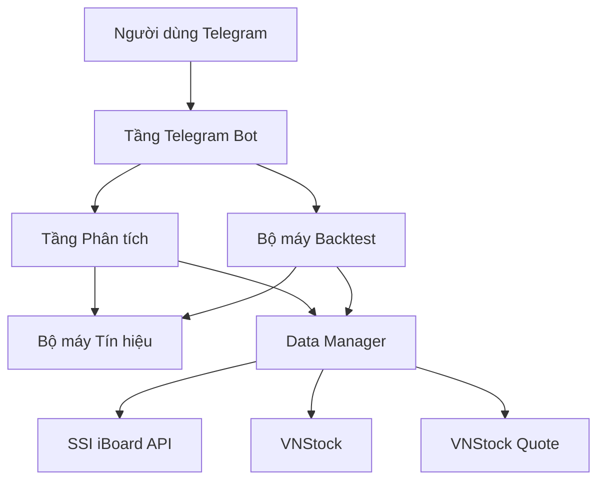
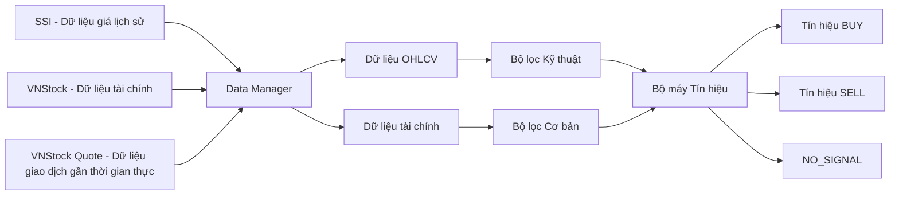
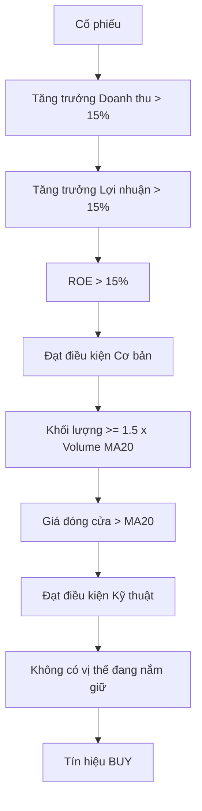
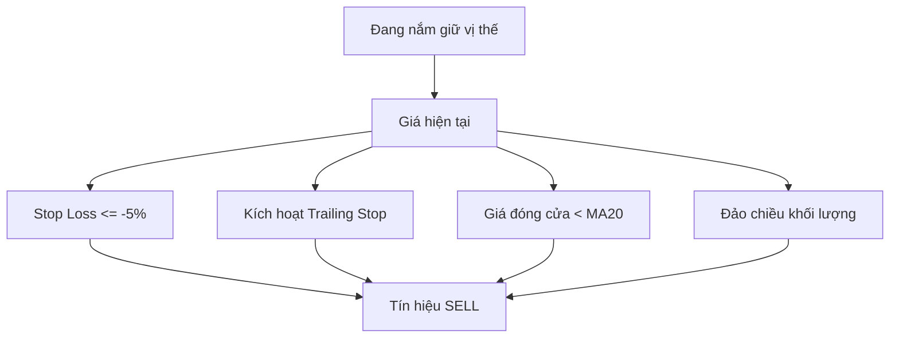
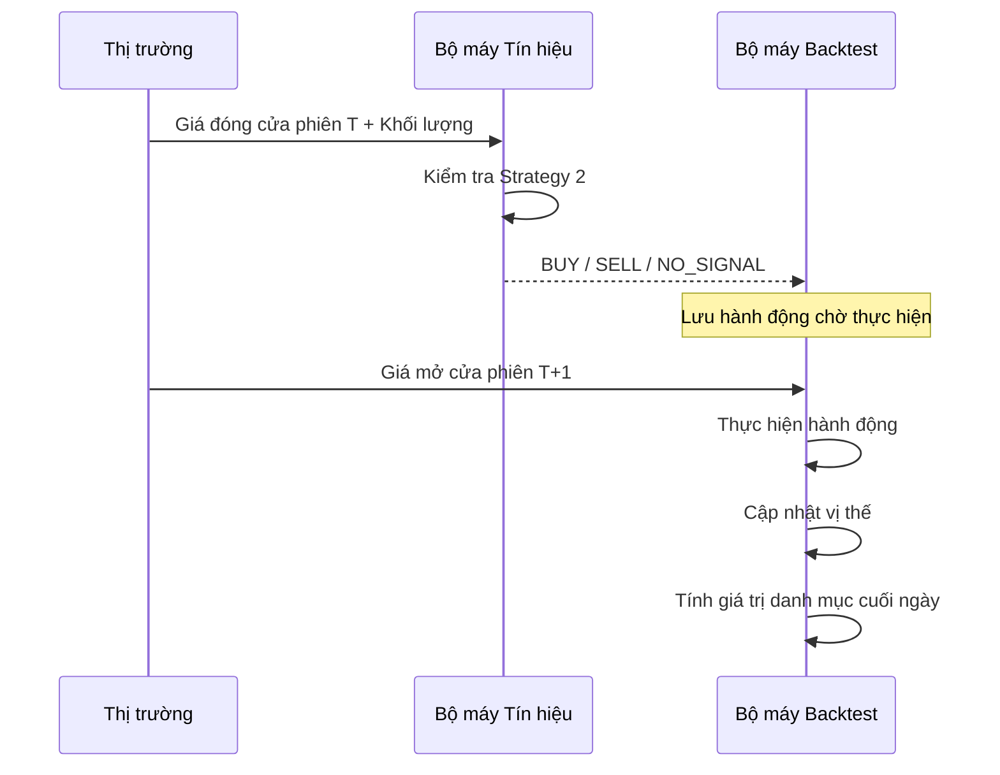
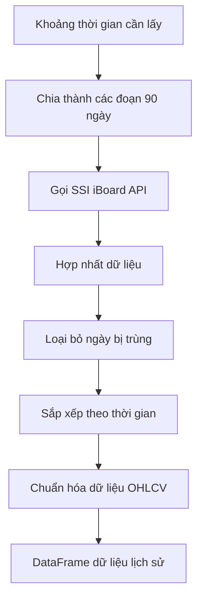

# FINSTOCKVN BOT

Telegram Bot hỗ trợ phân tích và theo dõi cổ phiếu Việt Nam.

Dự án được xây dựng bằng Python, kết hợp dữ liệu thị trường, dữ liệu tài chính doanh nghiệp và các chỉ báo kỹ thuật để hỗ trợ nhà đầu tư trong quá trình sàng lọc và đánh giá cổ phiếu.

## Mục tiêu dự án

FinStockVN Bot được xây dựng với các mục tiêu chính:

- Thu thập dữ liệu giá và khối lượng giao dịch cổ phiếu Việt Nam.
- Lấy dữ liệu tài chính của doanh nghiệp.
- Tính toán các chỉ số tài chính quan trọng.
- Phân tích tín hiệu mua/bán dựa trên chiến lược đầu tư định trước.
- Hỗ trợ theo dõi giá cổ phiếu theo thời gian thực.
- Backtest chiến lược trên dữ liệu lịch sử.
- So sánh hiệu suất chiến lược với VN-Index.
- Cung cấp kết quả phân tích thông qua Telegram Bot.

## Đối tượng sử dụng

Dự án hướng đến:

- Sinh viên ngành Tài chính - Ngân hàng và Fintech.
- Người học phân tích tài chính và phân tích cổ phiếu.
- Người muốn xây dựng hệ thống stock screening bằng Python.
- Nhà đầu tư cá nhân cần một công cụ hỗ trợ sàng lọc cổ phiếu.

> Lưu ý: Bot chỉ mang tính chất hỗ trợ phân tích và học tập, không phải hệ thống tư vấn đầu tư hoặc khuyến nghị đầu tư chuyên nghiệp.

## Tính năng chính

### 1. Phân tích cổ phiếu

Bot cung cấp thông tin phân tích cho từng mã cổ phiếu, bao gồm:

- Giá hiện tại.
- Khối lượng giao dịch.
- Doanh thu.
- Tăng trưởng doanh thu.
- Lợi nhuận sau thuế.
- Tăng trưởng lợi nhuận.
- EPS.
- ROE.
- Debt/Equity.
- P/E.
- P/B.
- Giá trị sổ sách trên mỗi cổ phiếu (BVPS).

### 2. Phân tích kỹ thuật

Bot sử dụng một số chỉ báo kỹ thuật để xác định xu hướng và tín hiệu giao dịch:

- Moving Average 20 phiên (MA20).
- Khối lượng giao dịch trung bình 20 phiên.
- Volume Breakout.
- Price Momentum.

### 3. Strategy 2

Chiến lược chính của Bot kết hợp phân tích cơ bản và phân tích kỹ thuật.

Điều kiện BUY:

- Revenue Growth > 15%.
- Net Income Growth > 15%.
- ROE > 15%.
- Volume >= 1.5 lần Volume Average 20 phiên.
- Close > MA20.
- Cổ phiếu chưa được nắm giữ.

### 4. Real-time Data

Bot có khả năng lấy dữ liệu giao dịch gần thời gian thực, bao gồm:

- Giá giao dịch gần nhất.
- Khối lượng giao dịch.
- Thời gian giao dịch.
- Loại khớp lệnh.
- Trade ID.

### 5. Market Overview

Bot cung cấp thông tin tổng quan thị trường thông qua VN-Index:

- Điểm số VN-Index.
- Phần trăm thay đổi.
- Khối lượng giao dịch.
- Số phiên dữ liệu.
- Market breadth.
- Top gainers.
- Top losers.

### 6. Watchlist và Alert

Người dùng có thể:

- Thêm cổ phiếu vào watchlist.
- Xóa cổ phiếu khỏi watchlist.
- Xem danh sách theo dõi.
- Đăng ký cảnh báo.
- Hủy cảnh báo.

### 7. Portfolio và Risk Monitoring

Bot hỗ trợ theo dõi vị thế cổ phiếu:

- Giá mua.
- Giá hiện tại.
- Số lượng.
- Giá trị vị thế.
- Lãi/lỗ.
- Tỷ trọng vị thế.

Bot cũng đưa ra một số cảnh báo rủi ro đơn giản đối với danh mục.

### 8. Backtest

Bot hỗ trợ kiểm tra Strategy 2 trên dữ liệu lịch sử.

Các nội dung được tính toán:

- Initial Capital.
- Final Capital.
- Total Return.
- Number of Trades.
- Winning Trades.
- Losing Trades.
- Win Rate.
- Average Return.
- Best Trade.
- Worst Trade.
- Profit Factor.
- Maximum Drawdown.
- Transaction Cost.

### 9. VN-Index Benchmark

Kết quả backtest của Strategy 2 được so sánh với VN-Index trong cùng khoảng thời gian.

Các chỉ tiêu chính:

- Strategy Return.
- VN-Index Return.
- Maximum Drawdown.
- Excess Return.

## Công nghệ sử dụng

| Thành phần | Công nghệ / Nền tảng |
|---|---|
| Ngôn ngữ lập trình | Python |
| Telegram Bot | python-telegram-bot |
| Giá lịch sử & OHLCV | SSI iBoard API |
| Dữ liệu tài chính | VNStock |
| Dữ liệu giao dịch gần thời gian thực | VNStock Quote |
| Dữ liệu thị trường VN-INDEX | VNStock Market |
| Xử lý & phân tích dữ liệu | Pandas |
| Phân tích kỹ thuật | Python, Pandas |
| Phân tích cơ bản | Python, Pandas, VNStock |
| Bộ máy tín hiệu | Python |
| Backtest | Python, Pandas |
| Kiểm thử | unittest |
| Quản lý phiên bản | Git / GitHub |
| Triển khai | Render |

## Cấu trúc hệ thống

Hệ thống được xây dựng theo kiến trúc phân lớp, tách biệt
giao diện Telegram, tầng phân tích, quản lý dữ liệu và các
nguồn dữ liệu bên ngoài.

## Luồng dữ liệu

## Chiến lược giao dịch — Strategy 2

Chiến lược kết hợp điều kiện tăng trưởng cơ bản với xác nhận
động lượng giá và đột biến thanh khoản.

## Chiến lược thoát lệnh (SELL)

SELL chỉ được xét khi nhà đầu tư đang nắm giữ vị thế.

## Quy trình Backtest

Hệ thống tạo tín hiệu tại giá đóng cửa của phiên T và thực hiện
lệnh tại giá mở cửa của phiên T+1.

##  Xử lý dữ liệu lịch sử

Do SSI iBoard có giới hạn dữ liệu khi truy vấn một khoảng thời gian
dài, hệ thống chia khoảng thời gian cần lấy thành nhiều đoạn nhỏ,
sau đó hợp nhất dữ liệu và loại bỏ các bản ghi trùng nhau.

## Danh sách thành viên

| STT | Họ và tên |
|---:|---|
| 1 | Nguyễn Hoàng Gia Việt Hưng |
| 2 | Huỳnh Hoàng Huyên |
| 3 | Đặng Như Huỳnh |
| 4 | Nguyễn Thị Thanh Nhã |
| 5 | Trương Thị Hoài Ny |
| 6 | Trần Hoàng Thịnh |
